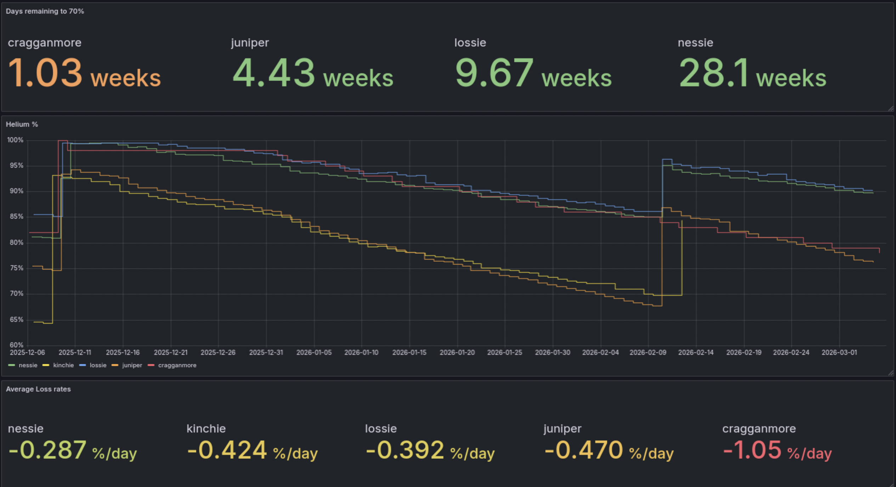
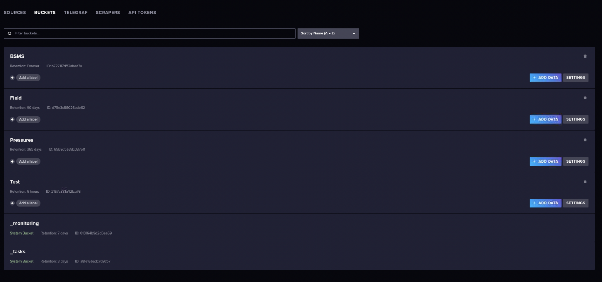
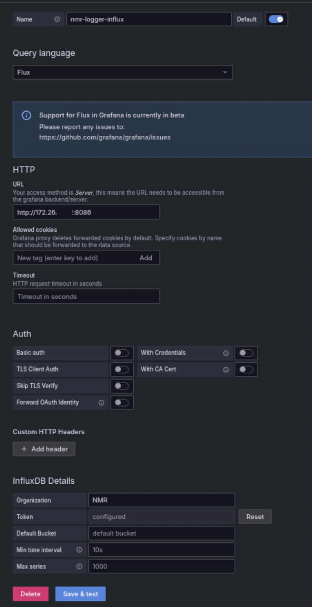
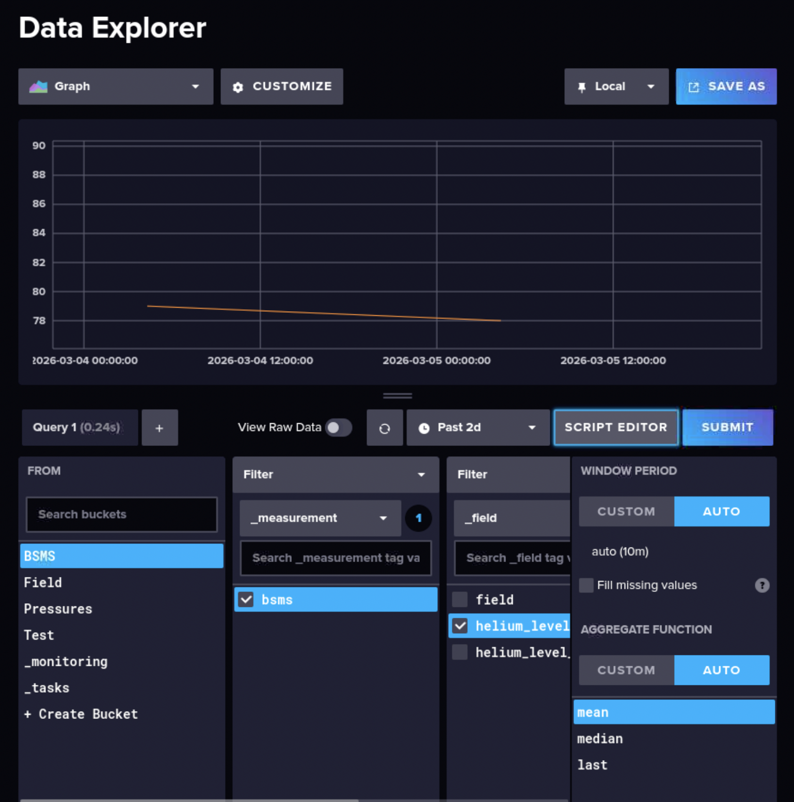
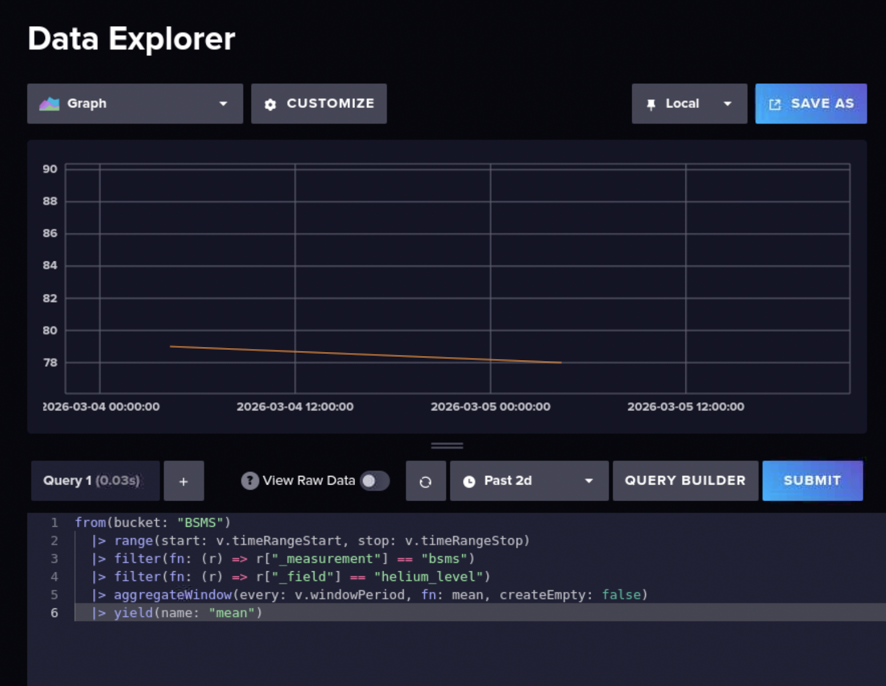
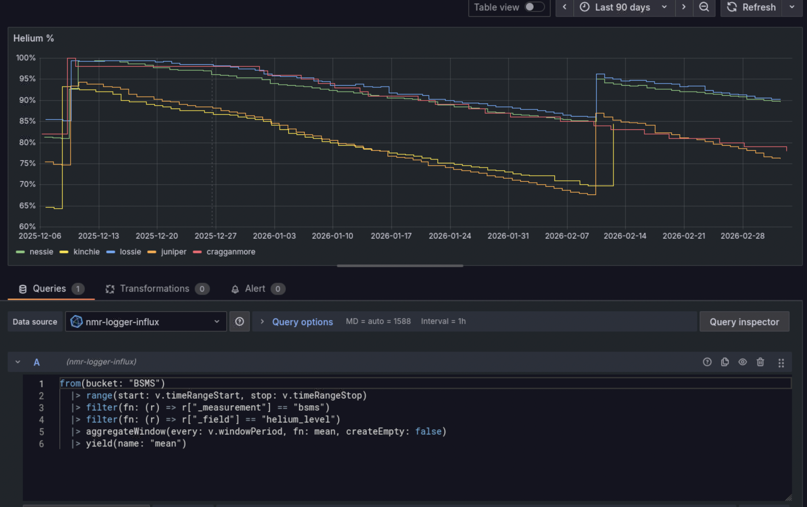

# NMR Facility Logging System

A centralized monitoring system for NMR facilities that tracks helium levels and pressures across multiple Bruker spectrometers

## Overview

The NMR logging system consists of:
- Central server (`nmr-logger`): Runs InfluxDB (time-series database) and Grafana (visualization)
- Spectrometer clients: Run Docker containers that push data to the central server

Data streams from each spectrometer:
1. MAS monitoring: Drive, bearing, main pressures, MAS rate
2. Field logging: Parsed from helium log files
3. Field detection: Useful e.g. for in situ work where the lock solvent chemical shift depends on the state-of-charge of a battery

This provides instructions for an Avance Neo system running in Almalinux, with a MAS3 unit (software 20240830_1845)



---

## Server Installation

### Prerequisites

The server must:
- Run continuously
- Be on the same network subnet as spectrometer computers
- Have Docker and Docker Compose installed
- Easier to set up in Linux

### 1. Install Docker and Portainer

Follow official documentation:
- Docker: https://docs.docker.com/engine/install/
- Portainer: https://docs.portainer.io/start/install-ce/server/docker/linux

### 2. Deploy NMR Logger Server
```bash
# Clone repository
git clone https://github.com/ThomasKressNMR/NMR-Facility-Logger.git
cd NMR-Facility-Logging/nmr-logger
Edit `.env` file: to set secure passwords for InfluxDB and Grafana

```bash
# Configure credentials
nano .env
```


```bash
# Start services
docker compose up -d

# Verify containers are running
docker compose ps
```

Access web interfaces:
- InfluxDB: `http://<nmr-logger-ip>:8086`
- Grafana: `http://<nmr-logger-ip>:3000`

### 3. Configure InfluxDB

#### Create Organization and Buckets

1. Access InfluxDB web interface at `http://<server-ip>:8086`
2. Create organization: `NMR`
3. Create buckets with appropriate retention policies:

Note: Consider retention carefully. Pressure data may not need long-term storage, but field logs are valuable for long-term trends. Test bucket is useful for development—data in InfluxDB is difficult to delete selectively.


#### Generate API Token

1. Navigate to: Data → API Tokens → Generate API Token
2. Choose token type:
   - All Access: Simpler, grants full permissions
   - Custom: More secure, grants access only to specific buckets
3. Copy token—it will be used in spectrometer `.env` files
4. Store token securely (you cannot retrieve it again). It could be a good idea to generate another token for grafana.

### 4. Configure Grafana

**Note:** You may be prompted to change your password if it's not strong enough.

#### Set up InfluxDB data source

1. Navigate to **Data sources > Add a new data source**
2. Select **InfluxDB (Flux)**
3. Enter the access token you generated earlier




#### Create dashboards

Option 1: Import templates

1. Go to Dashboards > New > Import
2. Select a template from the `grafana/` folder
3. If the import fails due to data source mismatch:
   - Navigate to Data sources and click on your InfluxDB data source
   - Copy the UID from the browser URL bar (format: `.../datasources/edit/<UID>`)
   - Open the dashboard JSON file in a text editor
   - Find and replace all occurrences of `"uid": "old-value"` with `"uid": "your-copied-UID"`
   - Save and re-import the JSON file

Option 2: Build custom dashboards

To construct Flux queries:
1. Open the InfluxDB web interface
2. Navigate to Data Explorer
3. Select the data you want to visualize

4. Switch to Script Editor

5. Copy the Flux query and paste it into Grafana
 
---

## Spectrometer Side Setup

Repeat these steps on each spectrometer computer.

### 1. Install Docker

For AlmaLinux/RHEL:
```bash
# Install repository management tools
sudo dnf -y install dnf-plugins-core

# Add Docker repository
sudo dnf config-manager --add-repo https://download.docker.com/linux/rhel/docker-ce.repo

# Install Docker components
sudo dnf install docker-ce docker-ce-cli containerd.io docker-buildx-plugin docker-compose-plugin

# Enable and start Docker service
sudo systemctl enable --now docker
```

For other distributions: See https://docs.docker.com/engine/install/

Verify installation:
```bash
docker --version
docker compose version
```

### 2. Configure Docker Permissions

Allow non-root users to run Docker commands:
```bash
# Create docker group (may already exist)
sudo groupadd docker

# Add current user to docker group
sudo usermod -aG docker $USER

# Add spectrometer software user
sudo usermod -aG docker nmrsu

# Activate group changes
newgrp docker
```


### 3. Install Portainer (Optional)

Portainer simplifies container management through a web interface.
```bash
# Create persistent storage
docker volume create portainer_data

# Run Portainer
docker run -d -p 8000:8000 -p 9443:9443 --name portainer --restart=always \
  -v /var/run/docker.sock:/var/run/docker.sock \
  -v portainer_data:/data \
  portainer/portainer-ce:lts
```

Access Portainer: `https://<spectrometer-computer-ip>:9443`

First-time setup:
1. Create admin account
2. Connect to local Docker environment
3. View and manage containers

### 4. Configure Hostname Resolution (Optional)

Simplify server access by adding hostname mapping:
```bash
# Edit hosts file
sudo vi /etc/hosts
```

Add entry (replace with your server IP):
```
<logger-server-ip> nmr-logger
```

Example:
```
192.168.1.100 nmr-logger
```

This allows using `http://nmr-logger:8086` instead of IP addresses in configuration files.

### 5. Deploy Logging Containers

#### Clone Repository
```bash
# Clone to appropriate location
git clone https://github.com/ThomasKressNMR/NMR-Facility-Logger.git
cd NMR-Facility-Logging/spectrometer
```

#### Edit `docker-compose.yml` file

```bash
nano docker-compose.yml
```

⚠️ **IMPORTANT: Comment out any services you don't need.** (e.g. you might not have a MAS unit, or not care about tracking the field at a second resolution)

Windows users: Change the volume mount from:
```yaml
- /opt/:/opt
```
to:
```yaml
- C:\Bruker\:/opt
```

#### Configure Environment Variables
```bash
# Edit configuration
nano .env
```

Required variables in `.env`:
```bash
# Spectrometer name (used as a tag in InfluxDB)
SPECTROMETER_NAME=spectrometer_name
ROOM_NAME=room
OWNER_NAME=nmrsu
MANAGEMENT_NAME=Facility

# InfluxDB v2 Configuration
INFLUXDB_URL=http://nmr-logger:8086
INFLUXDB_TOKEN=<replace with influxDB token>
INFLUXDB_ORG=NMR

# Configuration variables
MAS_IP_ADDRESS=149.236.99.9:20010 # you can find this in ha
MAS_USERNAME=Service # default username
MAS_PASSWORD=service # default username
MAS_INTERVAL_SECONDS=10
MAS_INFLUXDB_BUCKET=Pressures

# Logging Configuration
HELIUM_INTERVAL_SECONDS=3600
HELIUM_LOG_DIR=/opt/topspin*/prog/logfiles/ # this is where the helium logfiles are located
HELIUM_LOG_FILE_NAME=heliumlog
HELIUM_INFLUXDB_BUCKET=BSMS
HELIUM_VOLUME_LITERS = 114 # Spectrometer helium capacity

# Field logging
FIELD_INFLUXDB_BUCKET=Field
DRIFT_LOG_INTERVAL_SECONDS=300
LOCK_DRIFT_URL=http://149.236.99.9:10001/LockDriftDiag.txt # BSMS Service Web > Lock > Lock Diagnostic > Download Drift Data
```

Note:
- See [Generate API Token](#Generate-API-Token) for token
- `HELIUM_LOG_DIR` will depend whether you are in linux or windows (tested on linux only ; ). `*` means it will find the latest logfile
- `LOCK_DRIFT_URL`: found `ha` > BSMS Service Web > Lock > Lock Diagnostic > Download Drift Data
- `MAS_IP_ADDRESS`: found in `ha`

#### Test Deployment
```bash
# Start in foreground to monitor logs
docker compose up --build
```

Watch for errors. if errors, it is probably the .venv file

#### Finalize Deployment

If no errors:
```bash
# Stop with Ctrl+C

# Start in background
docker compose up -d

# Verify containers are running
docker compose ps
```

If errors occur:
```bash
# Stop with Ctrl+C

# Edit configuration
nano .env

# Clean up old containers and images
docker compose down
docker volume prune -f
docker image prune -f

# Retry
docker compose up --build
```


## License

Copyright (C) 2025 Thomas Kress

This project is licensed under the GNU General Public License v3.0 - see the [LICENSE](LICENSE) file for details.